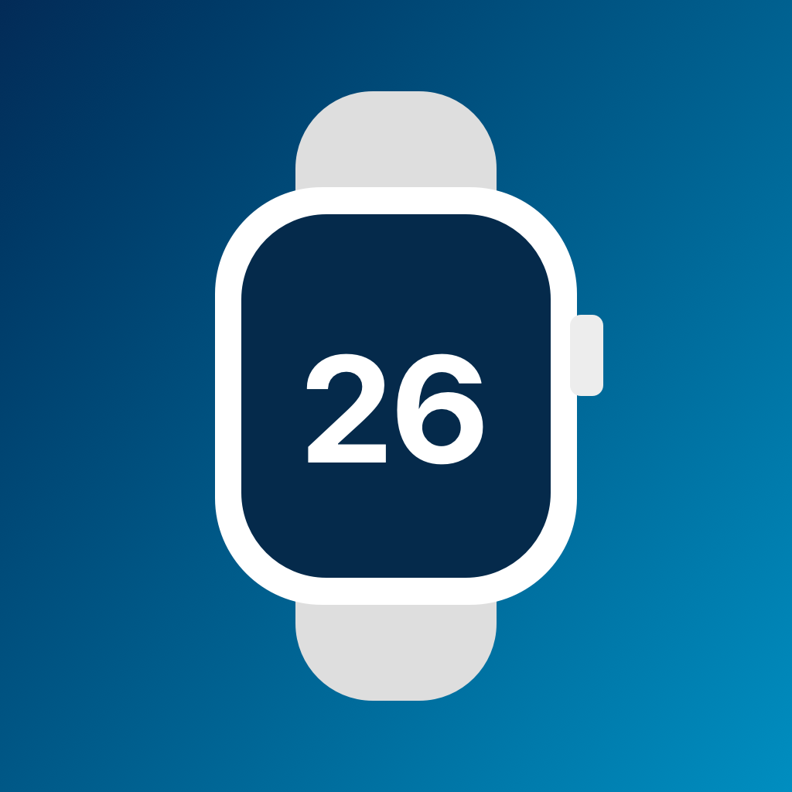

<p align="center"></p>

# PairBack

PairBack prepares an **iPhone 16 Pro on iOS 18.6.2 (22G100)** to pair an Apple Watch Series 10 running watchOS 26.5, without updating the iPhone or installing a full jailbreak. It packages the three data changes used in the pairing experiment into one focused iPhone app. It refuses to run its exploit or apply changes on a different model or build.

The pairing experiment completed activation and setup, and the watch worked in ordinary use. Apple Watch Mirroring connected on one later retry but was intermittent; PairBack does not claim to fix that feature.

## What it changes

| Target | PairBack value | Purpose |
| --- | --- | --- |
| `/Library/Preferences/FeatureFlags/Domain/NanoRegistry.plist` → `networkrelay_pairing.Enabled` | `true` | Lets iOS 18 enter the Network Relay pairing path. |
| MobileGestalt cache → `appleInternalInstall` in CacheData and CacheExtra | `1` | Passes the separate internal-install check in iOS 18 Bridge. |
| `com.apple.NanoRegistry` mobile-user preferences | `99 / 23 / 10 / 6` | Raises the pairing compatibility maximum while keeping the other observed limits. |

PairBack's persistent system-data edits are limited to those target entries; unrelated plist entries are preserved. It does not patch executable code, change the watch, update iOS, or install launchd persistence. The NanoRegistry values are written through CFPreferences so cfprefsd receives them, then checked on disk and through the preference API. Bridge and NanoRegistry can still hold old values until the iPhone restarts.

`appleInternalInstall` is a device-wide MobileGestalt value. Other system components may see it while enabled. PairBack keeps the prior value for a selective restore, but its effect outside the pairing path has not been exhaustively measured.

## Install and use

Download the unsigned IPA from [Releases](https://github.com/RomashkaTea/apple-pairback/releases), then sideload it with iLoader. PairBack is intentionally unsigned because the original test device used manual sideloading.

1. Tap **Prepare Access**. This runs the pinned Lara DarkSword access method, loads the needed offsets, and opens file access. DarkSword has caused a kernel panic on this phone during research; PairBack never retries it automatically.
2. Tap **Read current values**. If all three settings are already enabled, PairBack reports that and Apply makes no change.
3. Tap **Apply all three settings**. PairBack saves original bytes in its app container before any write, verifies each result, and keeps a recovery receipt if temporary file ownership cannot be restored.
4. Restart the iPhone normally, then pair the watch. If “Connecting your Apple Watch” persists, restart the iPhone once more so `nanoregistryd` reloads its compatibility limit. If a failed attempt leaves an **Apple Watch** entry in iPhone Settings → Bluetooth, forget that specific entry before retrying; a stale Bluetooth bond blocked a retry in the experiment.

**Restore saved values** reverses entries changed by PairBack while preserving unrelated values added later. It needs Prepare Access again after a reboot. The backup lives in the app's `Documents/PairBackBackup`; keep the app installed until you have restored or exported that backup. Restore cannot undo earlier changes made by Lara or Cyanide before PairBack was installed.

The already-paired research phone has these settings applied. Installing PairBack alone does not change the phone, and there is no need to run DarkSword again just to keep that pairing working.

## Safety boundary

- The app checks `hw.machine == iPhone17,1` and `kern.osversion == 22G100` before acquiring kernel access or writing.
- The MobileGestalt lookup must resolve the exact hashed key to the independently measured CacheData offset `248`; unexpected offsets, layouts, or values fail before a write.
- NanoRegistry's file and CFPreferences domain must agree before Apply or Restore. PairBack refuses to overwrite a mismatched cache.
- Backups are written and read back before changes. File ownership changes are limited to fixed paths, recorded first, restored immediately, and checked afterward.
- The vendored DarkSword acquisition is unchanged. Its optional launchd persistence branches are compiled out, and their implementation is not linked. See [vendor provenance](Vendor/Lara/README.md).

No code can guarantee that a kernel exploit will never panic. PairBack has not been run on a fresh phone as a complete end-to-end test; its build, data planner, rollback checks, and IPA archive are verified locally.

## Build

Requires Xcode with an iOS SDK and [XcodeGen](https://github.com/yonaskolb/XcodeGen).

```sh
swift test
scripts/package_unsigned_ipa.sh
```

The script creates `dist/PairBack-unsigned.ipa` and `dist/SHA256SUMS`. The source and its vendored Lara subset are provided under [AGPL-3.0](LICENSE).
